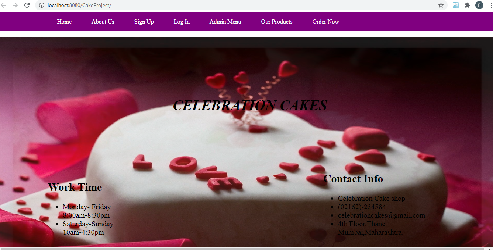
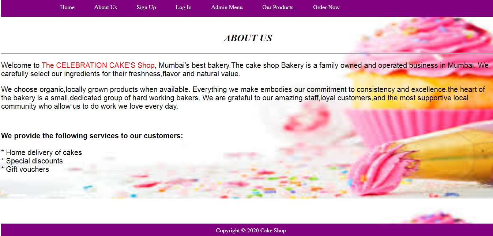
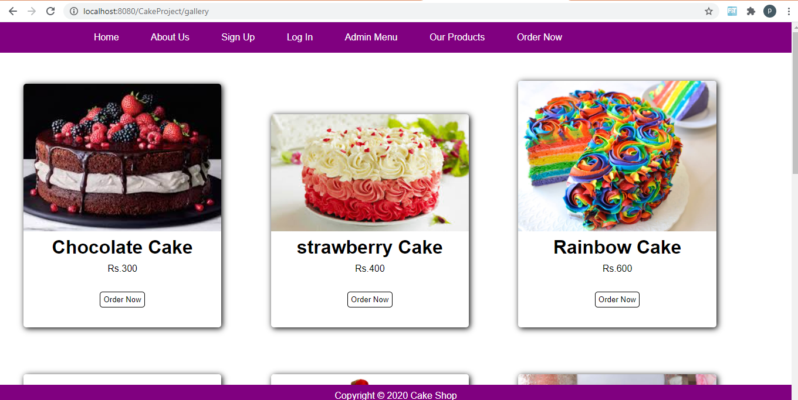
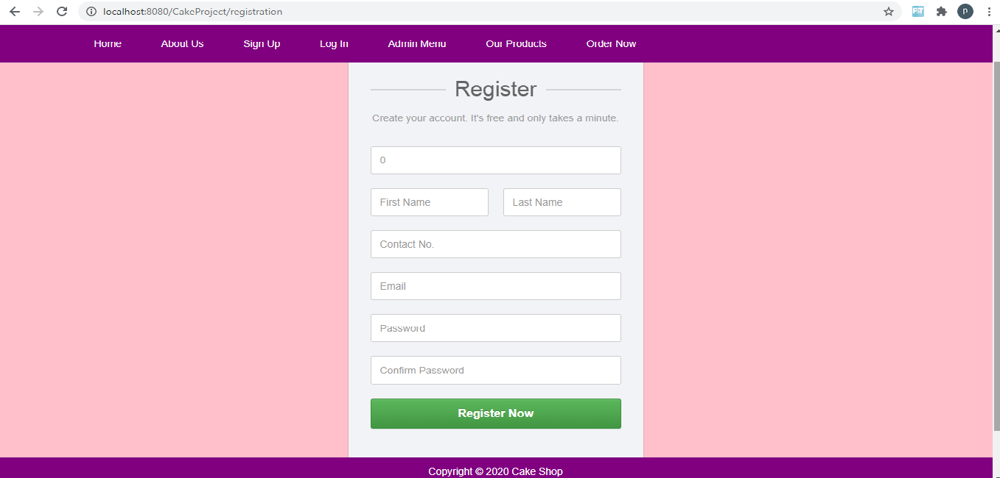
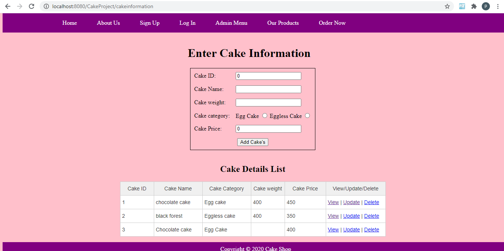
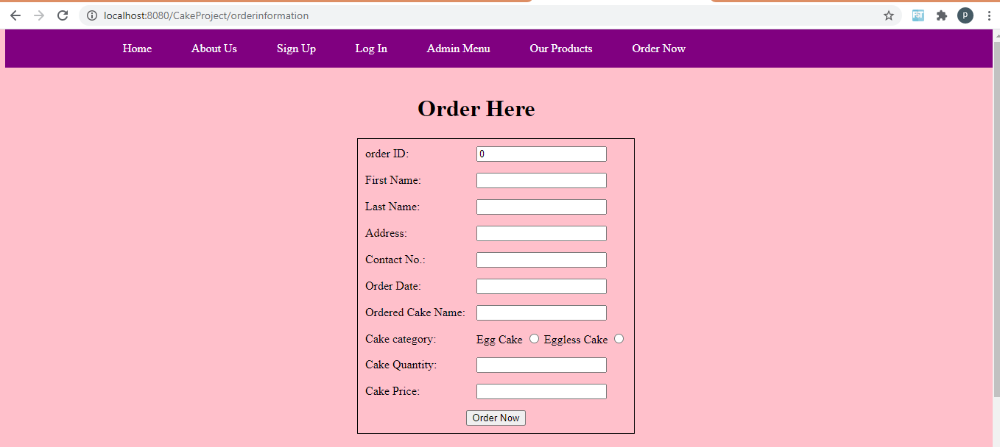

# Cake Shop

A Cake Shop Website built with Spring Framework , JSP, Hibernate, MySql.
It contains the customer or user and admin login. This system provides information about the cakes like its name,category,price and weight. In this Cake shop website after the login, customer can able to place the order, view all cake related information, order history and confirm the order. 
In this website after the  admin login, Admin can able to add cake related information, view all orders and also can able to add cake shops on different locations.

## Functionality Performed by Customer
- Customer Registration: Any customer can register on website using the registration form.
- Customer Login: Using login form, from where customer can login into the system.
- Customer operations: customer can view all cakes category and order them and also receive confirmation message of successful order.

## Functionality performed by Admin
- Admin Registration: Admin should first register on website using the registration form.
- Admin Login: Using login form, admin can login into the system.
- Admin operations: Only Admin can perform Add/Update/Delete/get List of cakes & manage Orders.
- Admin operations: Only admin can perform Add and delete branches of cake shops and also get list of cake Shops.

## Technology used in project (Cake Shop Website)
- Spring framework *(Backend)*
- Hibernate *(ORM tool)*
- MySql *(MySql Database has been used as database for the project)*
- HTML *(Page layout has been designed in HTML)*
- CSS *(Css has been used for all designing parts)*
- JSP *(All the frontend logic written in JSP)*
- JSTL tags *(JSTL tags used in JSP)*
- Bootstrap *(Bootstrap used for Registration and Login page)*
- junit Testing *(Unit Testing is done using junit)*
- Tomcat *(Project will be run locally over the tomcat server)*

## Requirements
For building and running the application you need:
- JDK 1.8
- Eclipse
- MySql

## Static Pages and other Sections
- Home Page with Good UI
- Home page will contain an javascript images annimation.
- Home page will contain an information about timing, address, email id, contact number and opening and closing time of cake shop.
- About us page will be available which will describe about the project
- My Products gallery page.

## Screenshots

